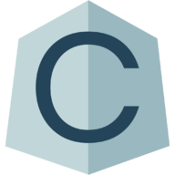
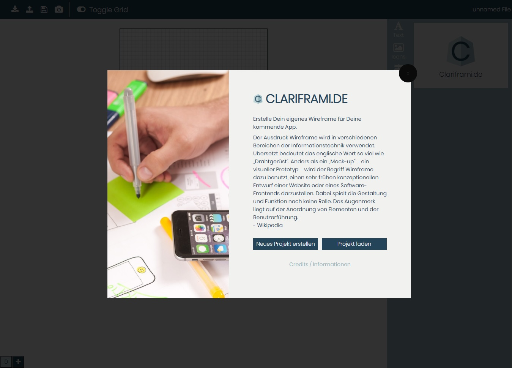
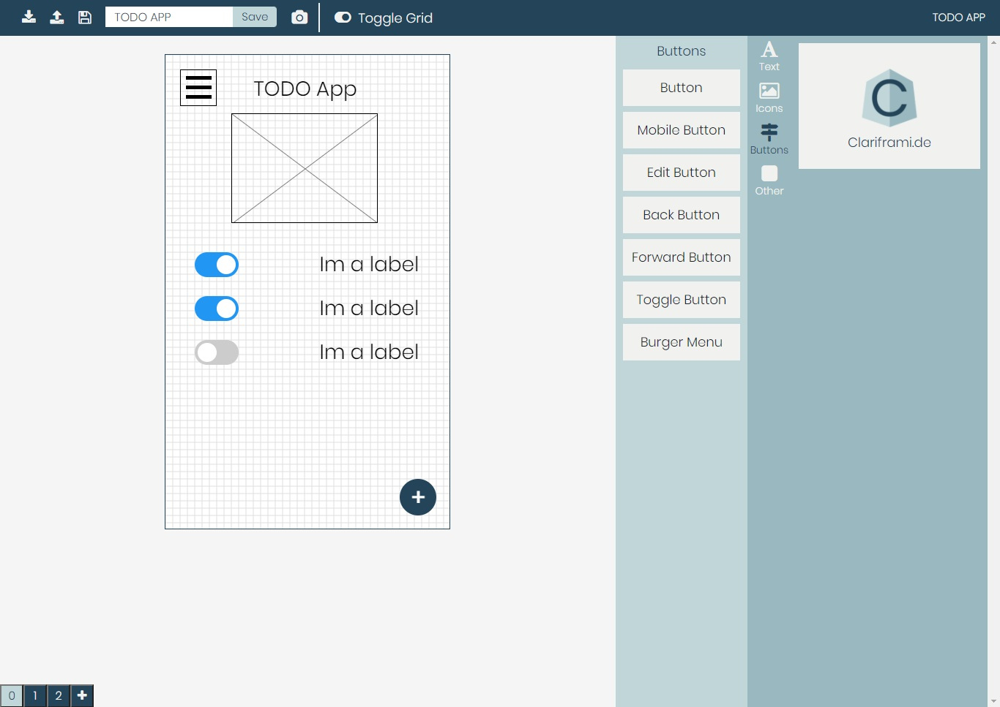

<!-- PROJECT LOGO -->
 

  

  <h3 align="center">Clariframe</h3>

  

    Clariframe is a Wireframing Application for Mobile Apps and Websites made with Angular.
  

<!-- ABOUT THE PROJECT -->
## About The Project

This web application was developed as part of a project by students of the Technical University of Central Hesse in the course of study Media Informatics Web and Mobile Application.

It was made in a team effort by 
* Andre Krebs   
* Adrian Werner 
* Mika Stamm    
* Noah Stürtz   
* Silas Buchwald

### Built With
* [Angular](https://angular.io/)
* [Bootstrap](https://getbootstrap.com)
* [GSAP](https://greensock.com/gsap/)

[product-screenshot]: images/into.jpg
